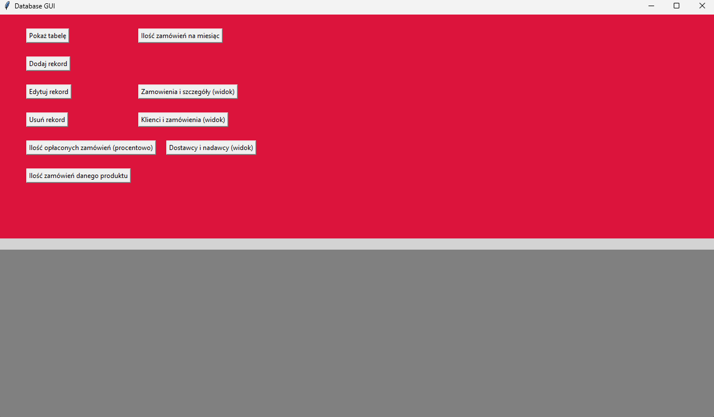
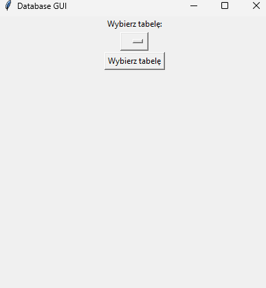
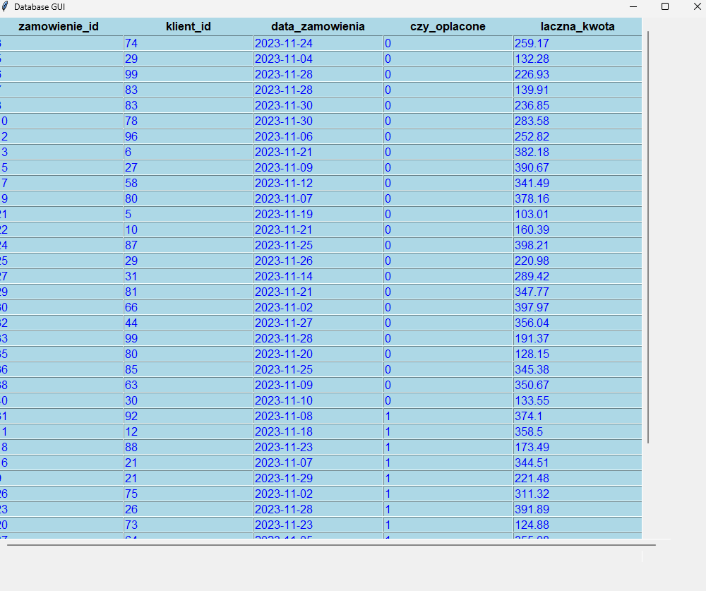
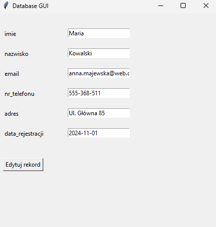
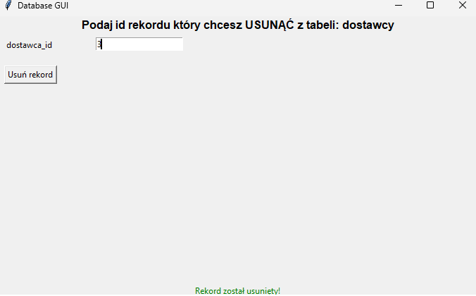
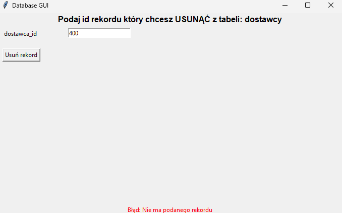
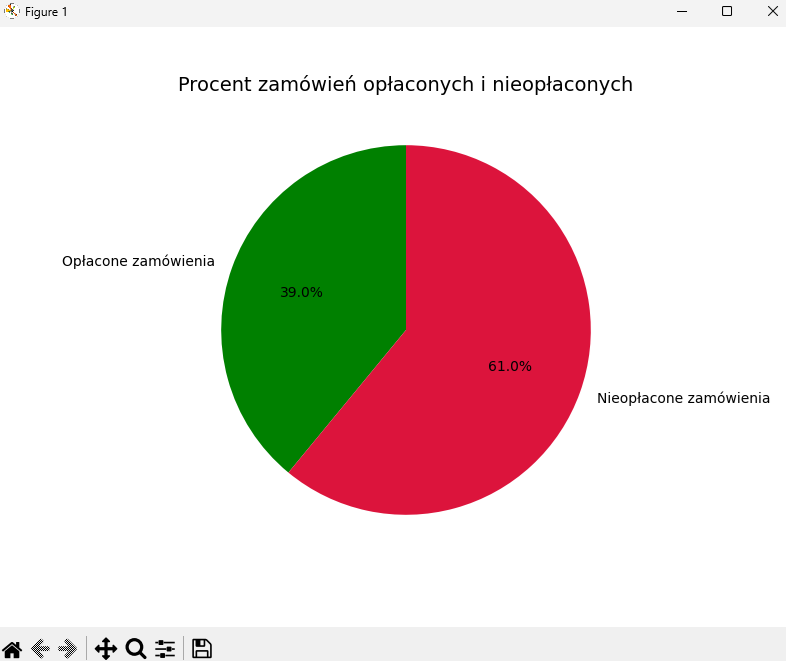
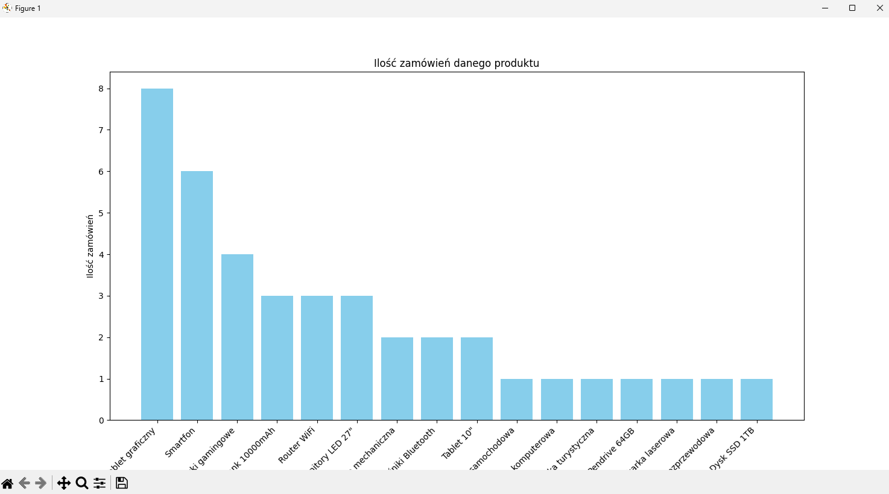
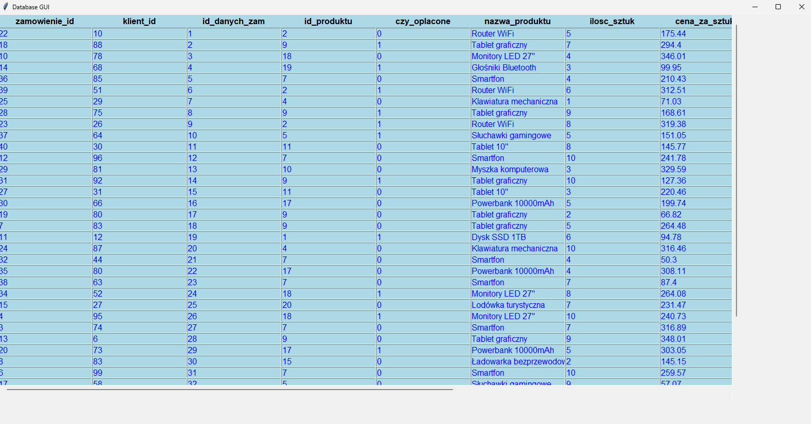

# Proste GUI dla admina bazy danych zarządzającego sklepem internetowym
### 1. Założenia projektu
Celem projektu było stworzenie aplikacji z interfejsem graficznym, która umożliwi zarządzanie bazą danych sklepu internetowego. Aplikacja łączy się z relacyjną bazą danych postawioną na darmowym serwisie tembo.io, umożliwiając  wykonywanie operacji na danych, takich jak przeglądanie, dodawanie, edytowanie i usuwanie rekordów w różnych tabelach (produkty, klienci, zamówienia, dane zamówień, pracownicy, dostawcy, nadawcy do magazynu), wyświetlanie raportów w postaci wykresów oraz widoków.
Funkcjonalności:
Dodawanie, usuwanie oraz edytowanie rekordów we wszystkich tabelach.
Generowanie raportów w postaci wykresów.
### 2. Prezentacja projektu
Po uruchomieniu projektu komendą ```python main.py``` lub uruchomieniu programu main.exe prezentuje się następujące okienko:

<p align="center">
  
  <br />
  Zdjęcie 1. Widok ekranu głównego aplikacji.
</p>

Program łączy się z bazą danych i działa na wcześniej stworzonych tabelach w programie DataGrip. Można za jego pomocą wyświetlić wszystkie dane z dowolnej tabeli w podłączonej do niego wcześniej stworzonej bazie danych.

<p align="center">
  
  <br />
  Zdjęcie 2. Okno wyboru tabeli do wyświetlenia.
</p>

Po wybraniu tabeli z rozwijanej listy wszystkie kolumny i wiersze pokazane są w osobnym okienku z suwakami poziomymi i pionowymi umożliwiającymi wyświetlanie i przewijanie danych.

<p align="center">
  
  <br />
  Zdjęcie 3. Okno prezentujące dane zawarte w tabeli "zamówienia".
</p>

Program umożliwia dowolne edytowanie, usuwanie oraz dodawanie rekordów do każdej z tabel zawartych w programie. Przykład edycji rekordu:

<p align="center">
  
  <br />
  Zdjęcie 4. Okno wyboru rekordu, który chcemy edytować.
</p>

<p align="center">
  
  <br />
  Zdjęcie 5. Okno edycji rekordu o wybranym wcześniej ID z tabeli "klienci".
</p>

Przykładowe usunięcie rekordu:

<p align="center">
  
  <br />
  Zdjęcie 6. Usunięcie rekordu, który istnieje w tabeli.
</p>

Aplikacja nie pozwala na usuwanie rekordów, których nie ma w bazie danych.

<p align="center">
  
  <br />
  Zdjęcie 7. Nieudane usunięcie rekordu, ponieważ taki nie istnieje w bazie danych.
</p>

Można także wyświetlać raporty w formie wykresów generowanych przez aplikację, oraz widoki, generowane na podstawie danych zawartych w bazie danych.

<p align="center">
  
  <br />
  Zdjęcie 8. Wykres kołowy prezentujący ilość zamówień opłaconych i nieopłaconych
</p>

<p align="center">
  
  <br />
  Zdjęcie 9. Wykres słupkowy prezentujący ilość zamówień danego produktu.
</p>

<p align="center">
  
  <br />
  Zdjęcie 10. Widok pokazujący dane z tabel "zamówienia" i "dane_zamówień".
</p>

### 3. Wymagania do uruchomienia aplikacji
Z racji tego, że baza danych używana w aplikacji jest postawiona na stronie internetowej tembo.io na moim koncie, do użycia jej potrzebne są dane do połączenia się z tą bazą danych, w tym między innymi hasło do niej. Udostępnianie tych danych na tym repozytorium byłoby ryzykowne, z tej racji umieściłem je w pliku password.env, który jest ignorowany i nie został wrzucony do repozytorium. Jednak można uruchomić ten program, tworząc konto na stronie tembo.io oraz samodzielnie tworząc plik password.env w głównym katalogu projektu oraz odpowiednie tabele i wypełnienie ich danymi. Projekt był tworzony od początku z zamysłem użycia internetowej bazy danych i nauki obsługi programu DataGrip, dlatego tabele nie są tworzone automatycznie przez aplikację oraz dane nie są przez nią wczytywane, zostało zrobione to ręcznie w celu edukacyjnym. Plik password.env powinien być napisany według formatu:
```
DB_NAME = nazwa_bazy_danych
DB_USER = nazwa_użytkownika_bazy_danych
DB_PASSWORD = hasło_do_bazy
DB_HOST = hostname_bazy_danych
DB_PORT = port
```
Oprócz tego trzeba zainstalować język Python oraz biblioteki opisane w pliku requirements.txt


